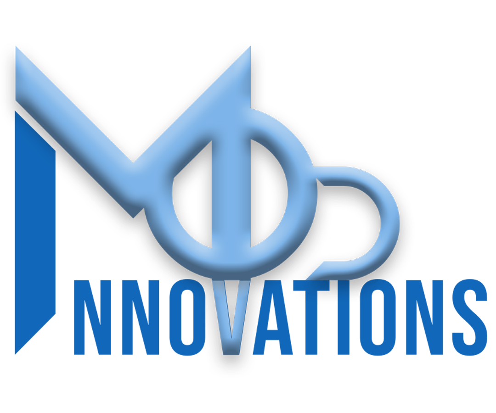
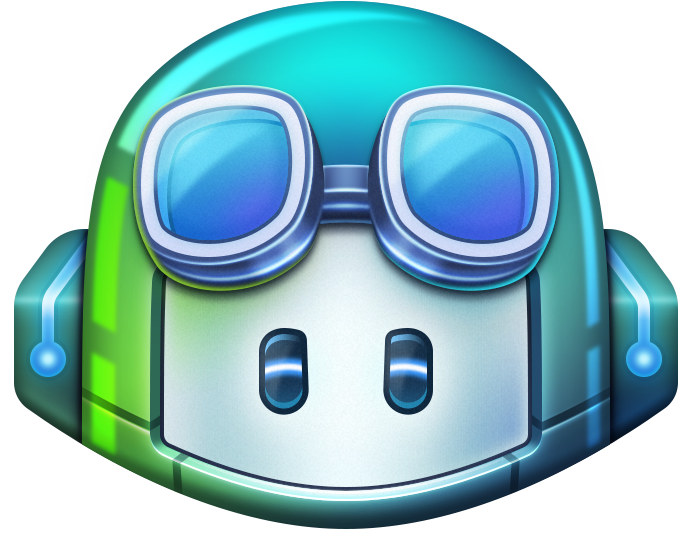

# Fullstack with CI/CD and chatGPT

    
    
    
    

This tutorial series provides a comprehensive guide to setting up a full-stack application with a RESTful API using Laravel for the backend, Quasar for the frontend, and modern CI/CD practices. Over three detailed episodes, you'll learn to integrate essential tools, streamline development workflows, and ensure robust deployment pipelines.

What You'll Learn:

Episode 1 focuses on foundational concepts, including using WSL and Docker for virtualized development environments. You'll set up Laravel within Docker, configure essential files like Dockerfile and docker-compose.yml, and get a working Laravel environment up and running. The episode also introduces CI/CD concepts with practical examples using GitHub Actions, culminating in a functional CI pipeline.

Episode 2 dives into the frontend with Quasar, guiding you through its installation and integration with Laravel. You'll set up Cypress for testing, configure frontend workflows in CI/CD pipelines, and explore Laravel Sanctum for secure authentication. By the end, you'll have built a basic connection test button and understood how to manage CSRF protection effectively.

Episode 3 brings it all together with Breeze for user authentication and focuses on frontend and backend integration. You'll implement registration and login functionality, handle session management with Sanctum, and debug CORS issues. The episode also covers state management in Quasar using a store, explores concepts like !! and isLoggedIn, and refines the user experience with dynamic UI changes based on authentication status. Finally, you'll ensure everything is working seamlessly with end-to-end Cypress tests and commit the final code.

## Episode Links

### YouTube Episodes
- [Episode 1](https://youtu.be/jszmgJ20DBc)
- [Episode 2](https://youtu.be/5YCva_JGPwE)
- [Episode 3](https://youtu.be/O3FiR6Re7jc)
- [Episode 4](https://youtu.be/HMu4D315kp8)

### Additional Resources
- [Laravel 11 by Jeffrey Way](https://youtu.be/SqTdHCTWqks?si=2k1MeJ-yQZkZkuIj)
- [Quasar by Make Apps with Danny](https://youtu.be/PjCqsf87Z1Y?si=J8Pw0f3hr4IeFX0q)
- [Docker by TechWorld with Nana](https://youtu.be/pg19Z8LL06w?si=oHCH1IeZaQMNh4AP)

This series is perfect for developers aiming to build a scalable web application with modern tools and workflows, while gaining insights into CI/CD, testing, and seamless frontend-backend communication.
